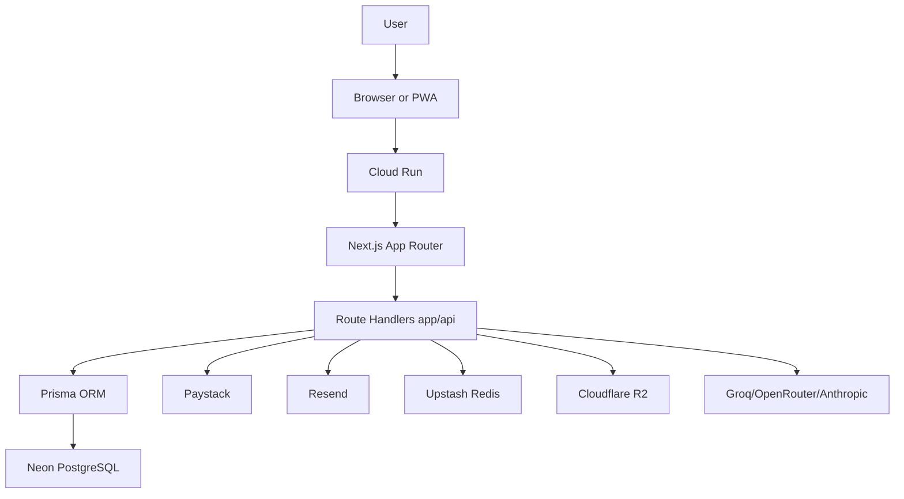
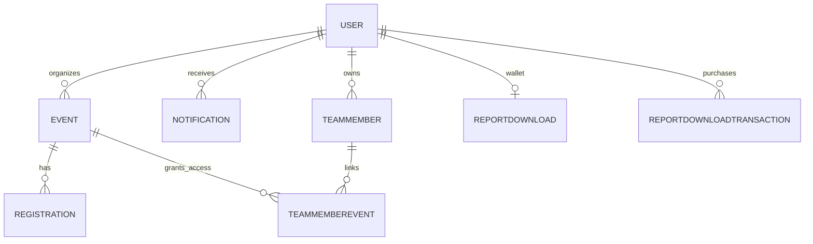
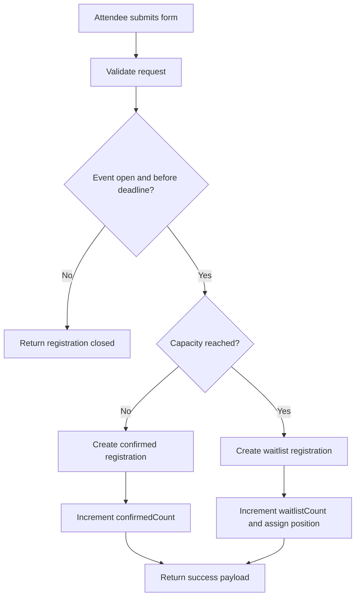
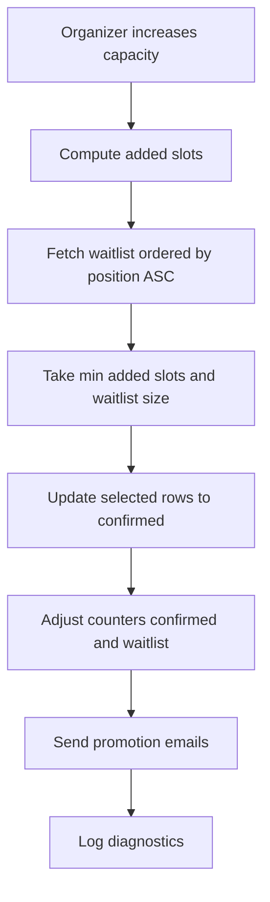
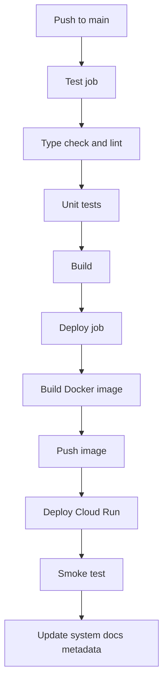

# Architecture and Flow Diagrams

This page visualizes the current EventSlot system topology and core runtime flows to support engineering, operations, and onboarding reviews.

## 1) Full system architecture

## 2) Database ER diagram

## 3) Registration flow diagram

## 4) Waitlist promotion flow diagram

## 5) GitHub Actions CI/CD pipeline diagram

